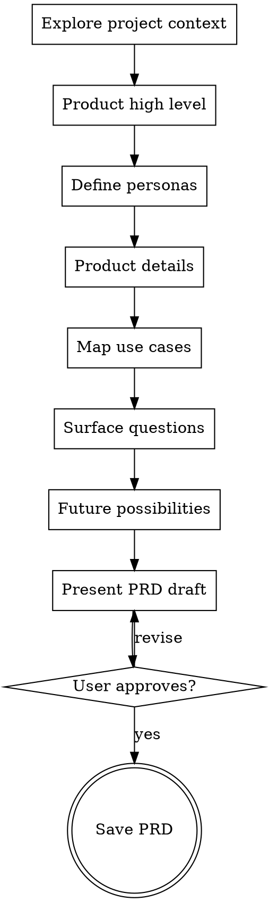

# Product Requirements Document

## Overview

Build a complete PRD through collaborative dialogue. Ask questions one at a time to understand the product, its users, and its boundaries. The output is a structured document covering the product vision, personas, details, use cases, open questions, and future possibilities.

<HARD-GATE>
Do NOT write the PRD until you have explored all six sections through conversation and the user has approved the direction. Even "obvious" products have hidden assumptions worth surfacing.

You are a FACILITATOR, not a product manager. You ask questions — the USER answers them. NEVER answer your own questions, fill in blanks with assumptions, or simulate user responses. If the user gives a short answer, ask a follow-up. If the user says "you decide", push back — their input IS the product requirement.
</HARD-GATE>

## Checklist

You MUST create a task for each of these items and complete them in order:

1. **Explore product context** - check codebase, docs, related tickets for existing context
2. **Understand the product (high level)** - ask questions about vision, problem being solved, target market
3. **Define personas** - identify users, what they want, care about, and find frustrating
4. **Clarify product details** - drill into specific features, constraints, technical boundaries
5. **Map use cases** - walk through concrete user journeys and scenarios
6. **Surface questions** - identify unknowns, risks, dependencies, decisions needed
7. **Explore future possibilities** - what comes after v1, what's explicitly out of scope now
8. **Present PRD draft** - compile into structured document, get user approval
9. **Save PRD** - write to `docs/plans/YYYY-MM-DD-<topic>-prd.md` and commit

## Process Flow



## The Process

### 1. Product - High Level

Understand the big picture before diving into details. **Target: 3-5 questions, output is a short paragraph (50-100 words).**

**Questions to explore:**
- What problem does this solve? For whom?
- What does success look like?
- What exists today? What's broken or missing?
- Is this a new product, a feature, or an improvement?
- What's the scope — MVP, full product, experiment?

**One question at a time.** Prefer multiple choice when you can offer reasonable options. Wait for the user's answer before asking the next question.

### 2. Personas

Identify 2-4 key user types. For each persona, explore three dimensions: **Target: 3-5 bullets per dimension, per persona.**

- **What they want** - their goals, what they're trying to accomplish
- **What they care about** - their priorities, values, non-negotiables
- **What frustrates them** - pain points, friction, things that make them give up

**Ask about one persona at a time.** First ask the user who uses the product (offer suggestions based on context). Then for each persona, ask about wants, cares, and frustrations separately — don't bundle all three into one question. Let the user describe each in their own words.

### 3. Product Details

Now drill into specifics. **Target: scale to complexity — a small feature gets 5-10 bullets total, a new product gets subsections with 5-10 bullets each.**

- Core features and capabilities
- Technical constraints or requirements
- Integration points with existing systems
- Data requirements
- Non-functional requirements (performance, security, scale)
- What's explicitly NOT in scope

**Stay at the product level.** Don't drift into API design, database schemas, or implementation details — those belong in a design doc. Focus on what the product does, not how it's built.

### 4. Use Cases

Walk through concrete scenarios. **Target: 3-6 use cases total, each with trigger/steps/success/edge cases.**

- Happy path for each persona
- Edge cases and error scenarios
- Boundary conditions
- How does the user discover and start using this?
- What happens when things go wrong?

**Use the format:** "As [persona], I want to [action] so that [outcome]." Then explore the steps with the user — ask them to walk you through how they imagine it working.

### 5. Questions

Surface everything that's unresolved. **Target: 5-15 questions as checkboxes.** These should be questions that emerged during the conversation, not generic templates.

- Technical unknowns
- Business decisions needed
- Dependencies on other teams or systems
- Risks and mitigation strategies
- Assumptions that need validation

**Don't try to answer these yourself.** The point is to make unknowns visible. Ask the user if there are questions you missed.

### 6. Future Possibilities

Explore what comes next, but keep it clearly separated from v1:

- Natural extensions of the current scope
- Features explicitly deferred and why
- Long-term vision
- What would change if this succeeds beyond expectations?

## PRD Output Format

Once all sections are explored, compile the PRD:

```markdown
# [Product Name] - Product Requirements Document

## 1. Product Overview
[High-level description, problem statement, success criteria, scope]

## 2. Personas

### [Persona Name]
- **Wants:** [goals and desired outcomes]
- **Cares about:** [priorities and values]
- **Frustrations:** [pain points and friction]

### [Persona Name]
...

## 3. Product Details
[Features, constraints, integrations, non-functional requirements, out of scope]

## 4. Use Cases

### UC-1: [Use Case Title]
**Persona:** [who]
**Trigger:** [what starts this]
**Steps:**
1. ...
**Success:** [expected outcome]
**Edge cases:** [what could go wrong]

### UC-2: ...

## 5. Open Questions
- [ ] [Question or decision needed]
- [ ] ...

## 6. Future Possibilities
- [Deferred feature and reasoning]
- ...
```

## Key Principles

- **One question at a time** - don't overwhelm with multiple questions
- **Multiple choice preferred** - easier to answer when you can offer reasonable options
- **Listen more than assume** - the user knows their domain better than you
- **Explore before concluding** - don't jump to solutions during discovery
- **Surface unknowns** - a good PRD makes risks visible, not invisible
- **Scale to complexity** - a small feature gets a lean PRD, a new product gets a thorough one
- **Product level, not implementation** - a PRD describes what the product does, not how it's built. No API designs, database schemas, or code architecture.

## Red Flags — STOP and Correct Course

If you catch yourself doing any of these, you are off track:

- **Answering your own questions** - you are the facilitator, not the product manager
- **Writing API endpoints or schemas** - you're drifting into design/implementation territory
- **Asking 3+ questions in one message** - slow down, one at a time
- **Skipping to the PRD draft** - you haven't explored all sections with the user yet
- **Assuming the user means X** - ask, don't assume
- **Making up personas** - suggest options, let the user confirm or correct
